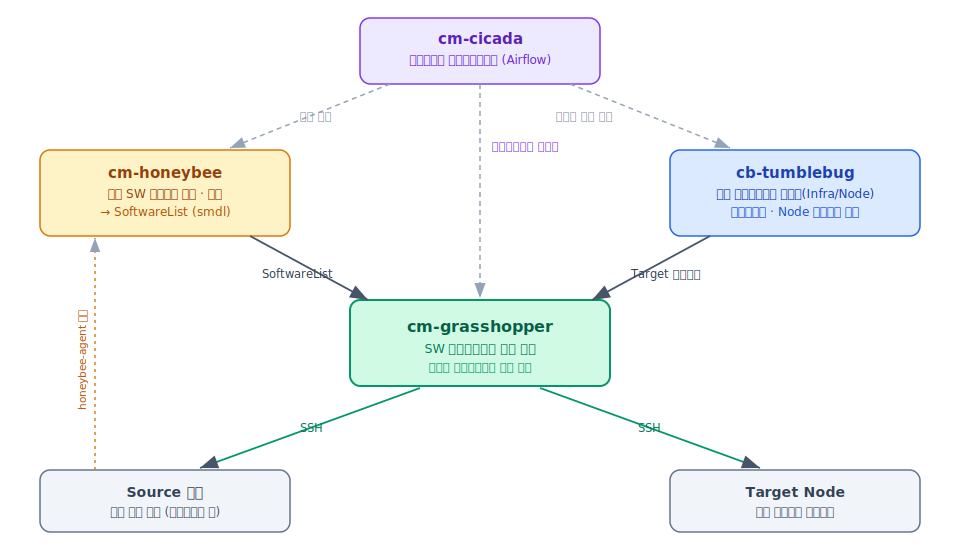
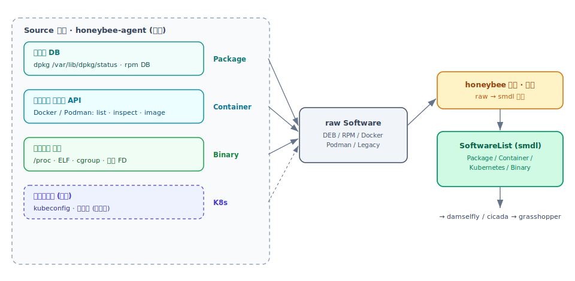
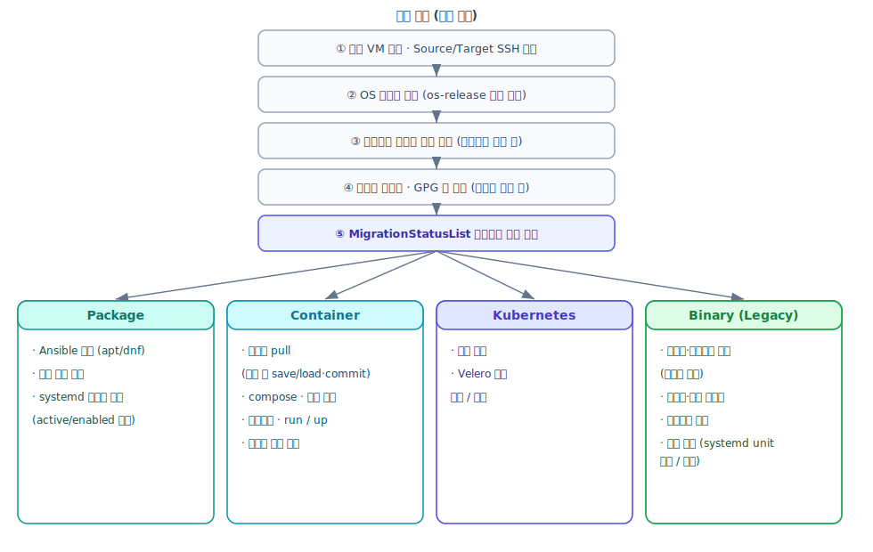
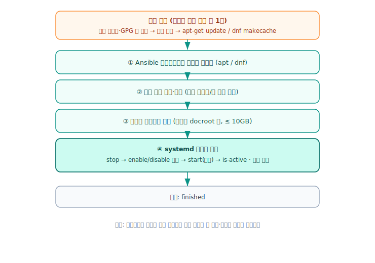
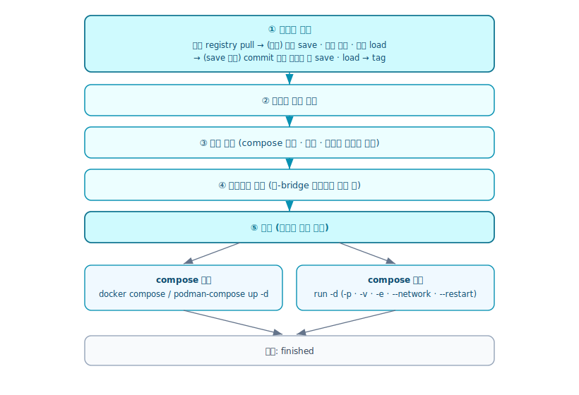
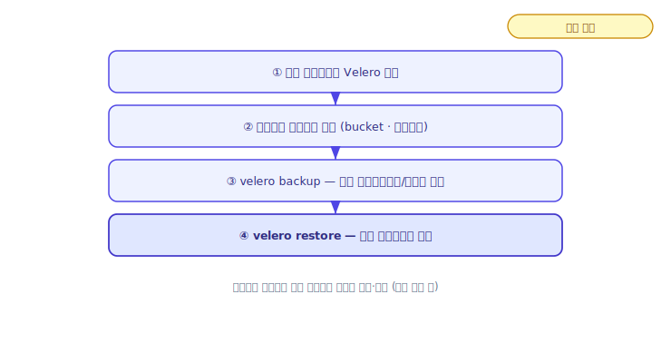
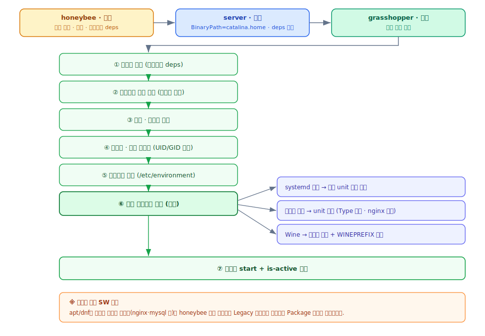
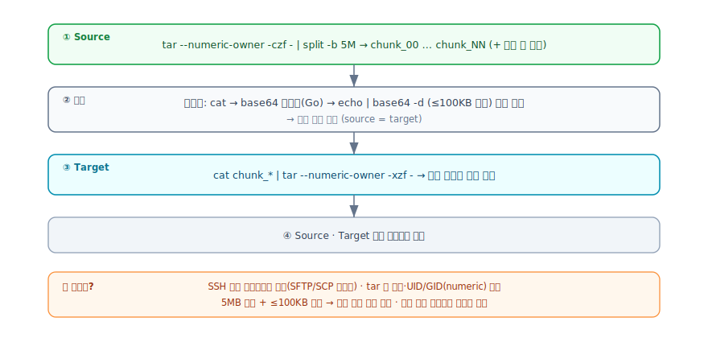
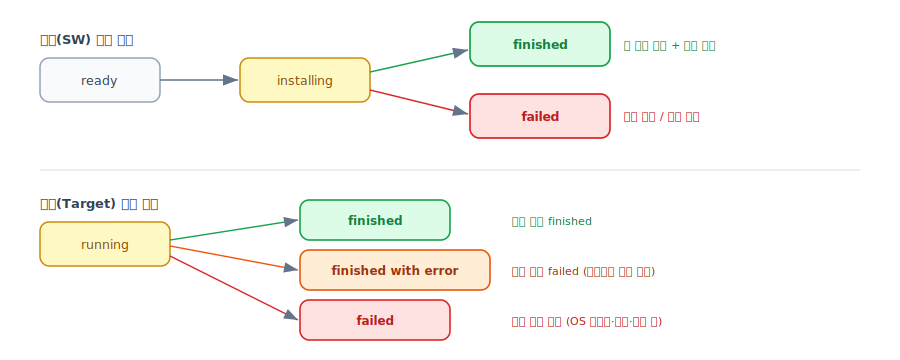

# 소프트웨어 마이그레이션 과정 

이 문서는 Cloud-Barista 마이그레이션 체계에서 **cm-grasshopper** 가 수행하는 소프트웨어(SW) 마이그레이션을 **Software Type 별로, 세부 과정 중심**으로 정리한 자료입니다. 

---

## 0. 한눈에 보기

| 타입 | 무엇인가 | 핵심 전략 | 상태 |
|---|---|---|---|
| **Package** | OS 패키지 관리자(apt/dnf)로 설치된 SW | 타깃에 **재설치** 후 설정·서비스 이전 | 지원 |
| **Container** | Docker/Podman 컨테이너로 동작하는 SW | **이미지 + 구성**을 옮겨 재기동 | 지원 |
| **Kubernetes** | 쿠버네티스 위에 배포된 워크로드 | **Velero 백업/복원** | 설계 |
| **Binary (Legacy)** | 패키지 관리자 밖에서 직접 실행되는 SW (예: `/opt/tomcat`) | **파일 그대로 복사 + 기동 방식 재현** | 지원 |

> 같은 SW 가 Package 와 Binary 양쪽으로 잡히지 않도록 **패키지 소유 여부**로 분리합니다(§5).

---

## 1. 전체 그림 — grasshopper 의 위치

SW 마이그레이션은 여러 구성요소가 협력하는 파이프라인의 **마지막 실행 단계**입니다.

| 구성요소 | 역할 |
|---|---|
| **cm-honeybee** | 소스에 에이전트로 붙어 **SW 인벤토리 수집** → 서버가 표준 모델(SoftwareList)로 **정제**. Package/Container/Kubernetes/Binary 4종 식별. |
| **cb-tumblebug** | 타깃 **멀티클라우드 인프라 프로비저닝·관리** 및 타깃 노드 **접속정보(IP·SSH 키)** 제공. |
| **cm-cicada** | **워크플로우 오케스트레이션(Airflow)**. "타깃 SW 모델 조회 → grasshopper 마이그레이션 → 결과 알림" 을 DAG 로 자동 실행. |
| **cm-grasshopper** | **SW 마이그레이션 실행 엔진**. 타깃 SW 모델을 받아 Source/Target 에 SSH 접속해 타입별 과정을 수행. |

> 보조적으로 **cm-beetle** 가 소스↔타깃 인프라를 매핑(타깃 노드에 `sourceMachineId` 라벨 부여)하고, **cm-damselfly** 가 타깃 SW 모델을 보관·제공합니다.
>
> **용어 주의 (cb-tumblebug):** 리소스 모델이 **MCI/VM → Infra/Node** 로 변경되었습니다. 타깃 조회 API 도 `/ns/{ns}/infra/{infra}/node/{node}` 형태를 사용합니다. 이 문서에서는 **Infra(구 MCI) / Node(구 VM)** 로 표기합니다.

---

## 2. 소스 인벤토리 수집·정제 (cm-honeybee)

grasshopper 가 옮길 수 있으려면, 먼저 honeybee 가 소스에서 "무엇이 어떻게 깔려 동작 중인지" 를 알아내야 합니다. 수집은 **에이전트(소스에서 실행)** 가, 표준화는 **서버(정제)** 가 담당합니다.

### 2-1. 수집 (에이전트) — 타입별 방법

honeybee-agent 는 소스 OS 위에서 타입마다 **서로 다른 소스(source of truth)** 를 읽습니다.

**Package — 패키지 DB 조회**
- Debian 계열: `/var/lib/dpkg/status` 를 파싱해 설치 패키지(이름·버전·아키텍처·`Depends`·설명 등)와, 패키지별 설정 파일 목록(`/var/lib/dpkg/info/<pkg>.conffiles`)을 수집.
- RHEL 계열: rpm DB 를 질의해 이름·버전·release·`Requires` 등을 수집.
- OS 가 기본 제공하는 패키지는 기본적으로 제외(노이즈 제거).

**Container — 런타임 API 조회**
- Docker/Podman 소켓에 API 로 접속해 컨테이너 **목록 + inspect + 이미지 inspect** 를 읽음.
- 수집 항목: 이미지(이름·태그·아키텍처·해시), 포트 매핑, 마운트/볼륨, 환경변수, 네트워크 모드, 재시작 정책, docker-compose 프로젝트 경로(label), 상태.

**Binary (Legacy) — 실행 중 프로세스 스캔**
패키지·컨테이너처럼 조회할 DB 가 없으므로, **돌고 있는 프로세스**에서 역으로 정보를 모읍니다.
1. 전체 프로세스를 순회하며 **LISTEN 소켓을 가진** 프로세스만 후보로 삼음(포트를 여는 서비스로 판단).
2. `/proc/<PID>` 에서 커맨드라인·환경변수·실행파일 경로·UID/GID 를 읽고, `sudo` 래퍼 같은 건 실제 실행 명령으로 정규화.
3. **패키지 소유 판별**(dpkg/rpm) — 패키지가 소유한 실행 파일이면 후보에서 제외(§5).
4. **ELF 분석** — `PT_INTERP` 유무로 정적/동적 링크를 판별하고, 동적이면 필요 라이브러리(NEEDED)와 메모리맵에 실제 로드된 `.so` 경로를 수집(libc·ld 등 시스템 기본은 제외).
5. **열린 파일(FD) 분석** — `.conf/.yaml/.json/.properties` 등은 **설정 파일**로, `.db/.sqlite`·`/var/lib` 류는 점수화해 **데이터 디렉토리**로 추론.
6. **cgroup 분석** — `system.slice/<unit>.service` 인지로 **기동 방식**(systemd vs 명령어)을 판별하고, systemd 면 unit 경로·`Type`·`PIDFile`·enable 여부까지 수집.
7. **버전 판별** — SW 정체성으로 분기(Tomcat=catalina.jar/RELEASE-NOTES, JDK=release 파일, 그 외=`--version` 실행, 타임아웃 시 강제 종료).
8. **Wine 판별** — `WINEPREFIX` 환경변수, 또는 wine 로더/`.exe` 인자로 인식(없으면 기본 prefix `~/.wine`).
9. **의존성 산출** — 복사가 필요한 **비패키지 소유** 경로(수동 설치 라이브러리·JDK 홈)만 추림.

**Kubernetes** — 에이전트 수집은 아직 미구현(설계). kubeconfig·클러스터 리소스 기반 수집을 예정.

### 2-2. 정제 (서버) — raw → 표준 모델(smdl)

수집된 raw 데이터(`DEB/RPM/Docker/Podman/Legacy`)는 honeybee 서버에서 grasshopper 가 그대로 쓰는 **표준 모델 `SoftwareList`(smdl)** 로 변환됩니다.
- **DEB/RPM → Package**, **Docker/Podman → Container**.
- **Legacy → Binary**: 이때 JVM 앱은 `-Dcatalina.home` 으로 **설치 루트(BinaryPath)** 를, JAVA_HOME 으로 **JDK 의존성** 을 도출하고, 기동 방식·버전·비패키지 의존성을 함께 채움.
- **Kubernetes** 변환은 TODO.

이 `SoftwareList` 가 (damselfly 보관 → cicada 트리거를 거쳐) grasshopper 의 입력인 **타깃 SW 모델**이 됩니다. 즉 **grasshopper 는 정제된 표준 모델만 보고** 마이그레이션을 수행합니다.

---

## 3. 공통 마이그레이션 절차

타입별 과정에 들어가기 전, 모든 마이그레이션이 공통으로 거치는 단계입니다.

### 3-1. 마이그레이션 목록 생성
정제된 SW 모델을 입력받아 실제로 옮길 항목만 추려 **MigrationList** 를 만듭니다.
- 패키지 중 **라이브러리(`lib*`,`*-dev` 등)·커널·패키지 관리자·컨테이너 런타임** 은 안정성·중복 방지를 위해 제외.
- 패키지 소유로 판정된 SW 는 수집 단계에서 이미 Binary 목록에서 빠져 있음(§5).
- 남은 항목에 **실행 순서(Order)** 를 부여.

### 3-2. 준비 (연결·타깃 노드 해석)
- **Source 연결** — honeybee 의 연결정보(자격증명)로 소스에 SSH 접속.
- **Target Node 해석** — honeybee 가 가진 소스 머신 ID 로, tumblebug 의 해당 **Infra** 안에서 `sourceMachineId` 라벨이 일치하는 **Node** 를 찾음.
- **Target 연결** — 그 Node 의 SSH 키로 타깃에 접속.
- 항목마다 진행 상태(`ready`)를 기록(이후 `installing` → `finished`/`failed`).

### 3-3. 실행 공통 단계
1. **OS 호환성 검증** — Source/Target 의 `/etc/os-release` 계열(Debian/RHEL)이 같은지 확인, 불일치 시 중단.
2. **컨테이너 런타임 선행 설치** — 컨테이너 대상이 있으면 타깃에 Docker/Podman 설치.
3. **저장소·GPG 키 이전** — 패키지 대상이 있으면 외부 저장소 설정을 먼저 옮기고 패키지 인덱스 갱신.
4. **타입 분기 실행** — MigrationList 를 **Order 순서대로** 돌며 타입별 절차 수행 + 상태 갱신.

---

## 4. Software Type 별 상세 과정

### 4.1 Package

OS 패키지로 깔린 SW. 바이너리를 옮기지 않고 **타깃에서 정식 재설치** 후 운영 상태를 맞춥니다.

**사전 단계 (패키지 대상이 하나라도 있으면 1회):** 저장소 마이그레이션
- 소스의 저장소 설정(`/etc/apt/sources.list*`, `*.list`, `*.repo`)과 **GPG 키** 를 수집한다.
- 타깃으로 옮겨 배포한 뒤 `apt-get update` / `dnf makecache` 로 인덱스를 갱신한다.
- 이 단계가 있어야 사설/서드파티 저장소 패키지도 타깃에서 설치된다.

**패키지별 절차**
1. **재설치** — Ansible 플레이북으로 apt/dnf 설치를 수행한다.
2. **설정 파일 탐색·복사**
   - 패키지가 소유한 설정 파일(conffiles)과 알려진 설정 경로를 탐색한다.
   - 각 파일을 타깃의 **동일 경로** 로 복사하며 **권한·소유자** 를 보존하고 심볼릭 링크를 처리한다.
   - 설정 파일이 참조하는 **인증서/개인키 경로** 도 함께 찾아 복사한다(SSL 구성 보존).
3. **데이터 디렉토리 복사** — 웹서버류(nginx/apache 등)는 문서 루트 같은 데이터 디렉토리를 복사한다. 단 **빈 디렉토리·과대(>10GB)** 는 건너뛴다.
4. **systemd 서비스 이전**
   - 패키지 관련 서비스를 찾고 시스템 기본 서비스는 제외한다.
   - 타깃에서 **정지 → enable/disable 을 소스와 동일하게 설정 → 역(逆)의존성 순서로 시작** 한다.
   - 마지막으로 `is-active` 와 **리스닝 포트** 가 소스와 일치하는지 검증한다.

### 4.2 Container

Docker/Podman 컨테이너. **이미지와 실행 구성** 을 옮겨 타깃에서 동일하게 띄웁니다.

1. **이미지 확보** (단계적 폴백)
   - 타깃에서 레지스트리 `pull` 시도.
   - 실패 시 소스에서 `save`(Podman 은 oci-archive) → **청크 단위 전송** → 타깃 `load` → 원래 태그로 `tag`.
   - `save` 마저 실패하면 소스에서 컨테이너를 `commit` 으로 스냅샷한 뒤 save/load.
2. **리스닝 포트 검증** — 소스에서 열려 있던 포트를 타깃에서 쓸 수 있는지 확인.
3. **구성 복사** — `docker-compose` 파일, 볼륨, 마운트 호스트 경로를 청크 전송으로 복사.
4. **네트워크 준비** — `bridge` 가 아닌 사용자 정의 네트워크면 타깃에 생성.
5. **기동** (구성에 따라 분기)
   - **compose 있음** → `docker compose up -d` / `podman-compose up -d`.
   - **compose 없음** → `run -d` 로 직접 기동하며 포트(`-p`), 마운트(`-v`, 호스트 경로 선복사), 환경변수(`-e`), 네트워크(`--network`), 재시작 정책(`--restart`)을 원본대로 재현.

### 4.3 Kubernetes

쿠버네티스 워크로드. **Velero** 기반 백업/복원으로 옮기도록 설계되어 있습니다(구현 진행 중).

1. 타깃 클러스터에 **Velero 설치**.
2. **오브젝트 스토리지**(bucket·자격증명) 설정.
3. 소스 네임스페이스/리소스를 **`velero backup`**.
4. 타깃 클러스터로 **`velero restore`**.

### 4.4 Binary (Legacy)

패키지 관리자 밖에서 직접 실행되는 SW(예: `/opt/tomcat` 의 Tomcat, 수동 설치 데몬, Wine 앱). 정식 설치 절차가 없으므로 **파일을 그대로 옮기고 기동 방식을 재현** 합니다.

**수집·정제에서 미리 결정되는 것 (honeybee)**
- **기동 방식** — 소스에서 그 SW 가 어떻게 떠 있었는지. 프로세스 cgroup 으로 systemd 관리 여부를 판별해, systemd 면 **unit 경로·enable 여부·Type·PIDFile** 까지, 명령어 실행이면 작업 디렉토리·커맨드라인을 수집.
- **버전** — SW 정체성으로 분기. Tomcat 은 `catalina.jar`(server.number)·RELEASE-NOTES, JDK 는 `release` 파일, 그 외 네이티브 바이너리는 `--version` 실행(타임아웃 시 강제 종료) 으로 추출.
- **설치 경로·의존성** — JVM 앱은 `-Dcatalina.home` 으로 **설치 루트** 를, JAVA_HOME 으로 **JDK 홈** 을 도출. 복사할 의존성은 **비(非)패키지 소유 경로만** 추림.

**grasshopper 실행 절차**
1. **의존성 복사** — 수동 설치된 런타임(예: `/opt/jdk`)을 타깃 동일 경로로 복사. (apt/dnf 로 깔린 런타임은 Package 가 담당하므로 제외)
2. **바이너리 경로 복사** — 설치 루트(`/opt/tomcat` 등)를 복사. `latest` 같은 **심볼릭 링크는 실제 대상 + 링크** 를 함께 재현해 깨지지 않게 한다.
3. **설정·데이터 복사** — 이미 복사된 디렉토리의 하위 경로는 중복 복사하지 않는다.
4. **사용자·그룹 재생성** — 소스의 **UID/GID 를 보존** 해 동일 계정/그룹을 만든다(없을 때만).
5. **환경변수 적용** — 앱에 필요한 변수(JAVA_HOME 등)를 `/etc/environment` 에 반영. 세션/런타임 전용 변수(USER·PATH·SYSTEMD_* 등)는 제외.
6. **기동 메커니즘 재현** (기동 방식별 분기)
   - **systemd 관리** → 원본 unit 파일을 동일 경로로 복사 후 daemon-reload·(원본이 enabled 면) enable·start.
   - **명령어 실행** → systemd unit 을 **합성**. Type 은 기동 방식이 확실한 `forking`(+PIDFile) 만 신뢰하고 그 외엔 `simple` 로 둔다. **nginx 처럼 자가 데몬화** 하는 바이너리는 `daemon off;` 로 foreground 고정.
   - **Wine 앱** → 타깃에 **Wine 런타임 설치** + bottle(WINEPREFIX) 복사 + 기동 시 `WINEPREFIX` 환경변수 주입.
7. **기동·검증** — 서비스를 시작하고 `is-active` 로 정상 기동을 확인한다.

---

## 5. 패키지 vs 바이너리 — 겹침 방지

`apt install nginx` 같은 **패키지로 설치된 리스닝 서비스** 는 패키지 인벤토리(dpkg/rpm)와 실행 프로세스 양쪽에 잡혀 **이중 마이그레이션** 될 수 있습니다. 이를 막기 위해 honeybee 수집 단계에서 **대표 설치 경로가 OS 패키지 소유인지** 검사합니다.

- **패키지 소유** → Binary 대상에서 제외 → **Package 경로** (예: nginx, mysql, redis)
- **비소유(수동 설치)** → **Binary 경로** (예: `/opt/tomcat`)

대표 경로는 **앱 경로**(JVM=catalina.home, Wine=WINEPREFIX)를 기준으로 잡습니다. 그래야 "Tomcat 은 수동 설치인데 그 위 Java 는 apt 설치" 인 경우에도 Tomcat 을 올바르게 Binary 로 분류합니다. 복사 의존성도 동일 원칙으로 패키지 소유 런타임은 빼고 수동 설치분만 옮깁니다.

---

## 6. 마이그레이션 메커니즘 보충

### 6-1. 대용량 파일·디렉토리 전송 — 청크 전송

패키지 데이터 디렉토리, 컨테이너 이미지·볼륨, 바이너리 설치 경로처럼 **큰 데이터를 Source → Target 으로 옮길 때** 사용하는 방식입니다. 별도의 SFTP/SCP 채널을 열지 않고 **SSH 명령 채널만으로** 바이너리 안전하게 전송합니다.

1. **압축·분할 (Source)** — 대상 디렉토리를 `tar --numeric-owner -czf -` 로 스트리밍 압축하고 `split -b 5M` 으로 5MB 청크(`chunk_00…NN`)로 나눈다. 이후 청크 개수를 확인한다.
2. **청크별 전송** — 청크를 `cat` 으로 읽어 **base64 로 인코딩**한 뒤, 명령 길이 한계를 넘지 않도록 **≤100KB 조각**으로 잘라 타깃에서 `echo '<조각>' | base64 -d` 로 이어붙여 기록한다. 청크마다 **크기를 검증**한다.
3. **재조립 (Target)** — `cat chunk_* | tar --numeric-owner -xzf -` 로 **동일 경로**에 원본을 복원한다(권한·UID/GID 보존).
4. **정리** — Source·Target 양쪽의 임시 디렉토리를 삭제한다.

**핵심 포인트**
- `tar --numeric-owner` 로 **권한·소유자(UID/GID)** 가 그대로 보존된다.
- base64 + 조각 전송이라 **바이너리 파일도 손상 없이**, SSH 명령만으로 전송된다.
- 5MB 청크 + 100KB 조각으로 **명령 길이·세션 한계를 회피**하고, 청크 단위 검증으로 안정성을 높인다.
- 바이너리 마이그레이션에서는 이 방식이 **심볼릭 링크 안전 복사**(실제 대상 복사 + 링크 재생성)와 결합된다(§4.4).

### 6-2. 마이그레이션 성공/실패 판별

성공 여부는 **항목(SW) 단위**와 **실행(Target) 단위** 두 수준에서 추적됩니다.

**항목(SW) 단위** — `ready → installing → finished | failed`
- 타입별 절차의 각 단계가 오류를 반환하면 즉시 해당 항목을 **`failed`**(오류 메시지 포함)로 기록하고 다음 항목으로 넘어간다.
- 모든 단계가 정상이고 **검증까지 통과**하면 **`finished`**.
- 타입별 검증 기준:
  - **Package** — 서비스가 `is-active` = active, enable 상태 일치, **리스닝 포트 일치**.
  - **Container** — 이미지 확보/기동(run·compose up) 성공, 포트 검증 통과.
  - **Binary** — 기동 후 `systemctl is-active` = active.

**리스닝 포트 검증**은 `ss`/`netstat` 대신 Source·Target 의 **`/proc/net/tcp(6)`·`udp` 를 직접 읽어** 해당 서비스 PID 의 LISTEN 포트를 비교합니다. 소스에 있던 포트가 타깃에 없으면 검증 실패로 처리합니다.

**실행(Target) 단위** — `running → finished | finished with error | failed`
- 시작 시 `running`.
- 모든 항목이 `finished` 면 **`finished`**.
- **일부 항목이 `failed`** 면 나머지는 계속 진행하되 실행 결과는 **`finished with error`**.
- OS 계열 불일치·연결 실패·로거 초기화 실패 같은 **초기 치명 오류**면 항목 진행 없이 **`failed`** 로 종료.
- 완료 시각(FinishedAt)을 기록한다.

**가시성** — 실행 ID 로 **상태 조회 API**(항목별 status + 실행 status)와 **로그 조회 API**(실행 단위 상세 로그: 스크립트·Ansible·SSH 출력·에러)를 제공해, 어디서 왜 실패했는지 추적할 수 있습니다.

---

## 7. 요약

- SW 마이그레이션은 **honeybee(수집) → tumblebug(인프라, Infra/Node) → cicada(오케스트레이션) → grasshopper(실행)** 파이프라인의 마지막 단계다.
- grasshopper 는 **연결·OS 검증·런타임/저장소 선행 준비** 후 타입별로 분기한다.
- **Package**: 저장소 이전 → 재설치 → 설정/데이터 복사 → 서비스 이전·검증.
- **Container**: 이미지 확보(폴백) → 포트 검증 → 구성 복사 → 네트워크 → compose up / run.
- **Kubernetes**: Velero 백업/복원(설계).
- **Binary**: 의존성·바이너리 복사(심링크 안전) → 사용자/환경 재현 → 기동 메커니즘(systemd 복사 / 합성 / Wine) 재현 → 검증. 패키지 소유 기준으로 Package 와 분리.
